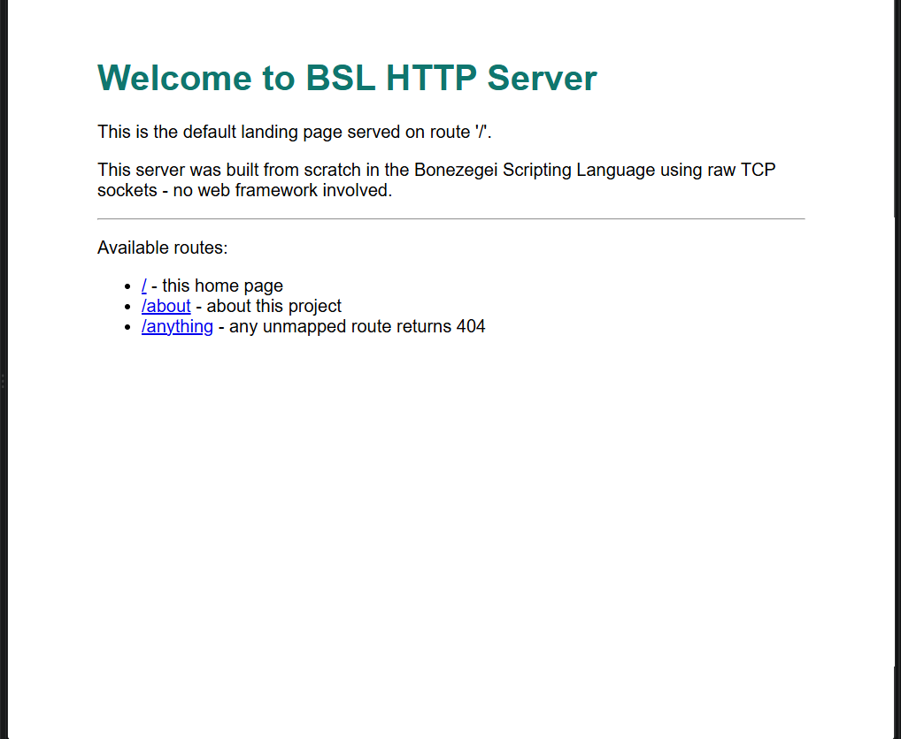
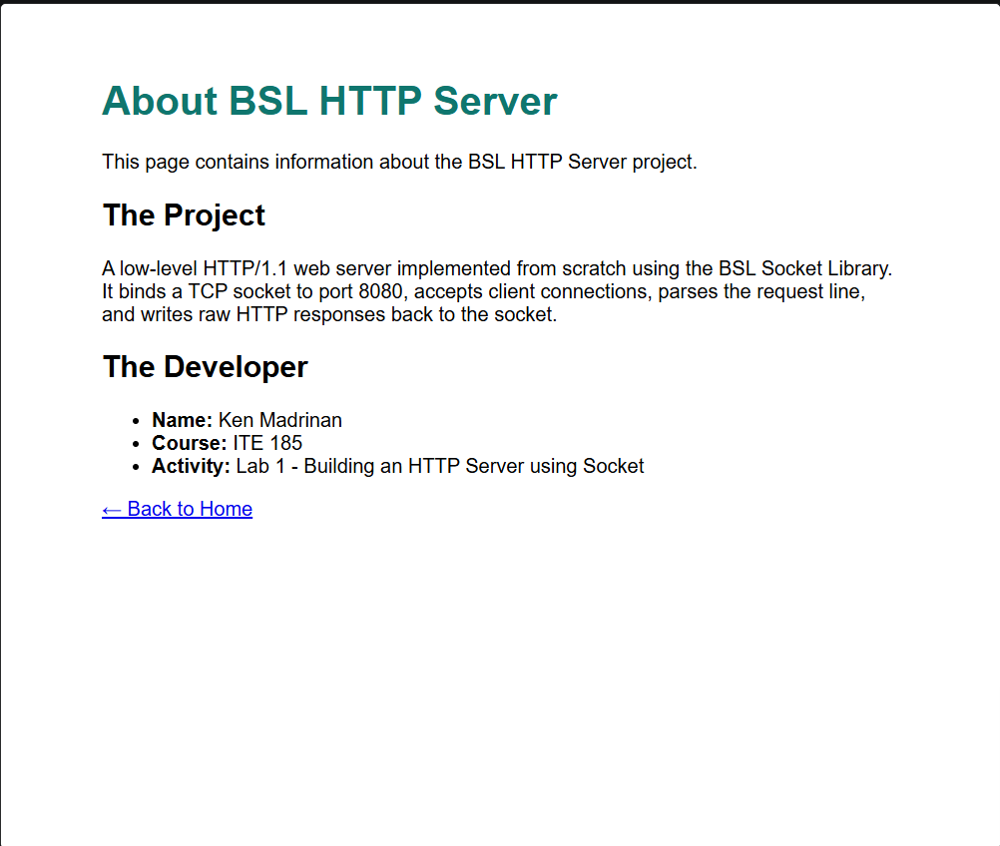
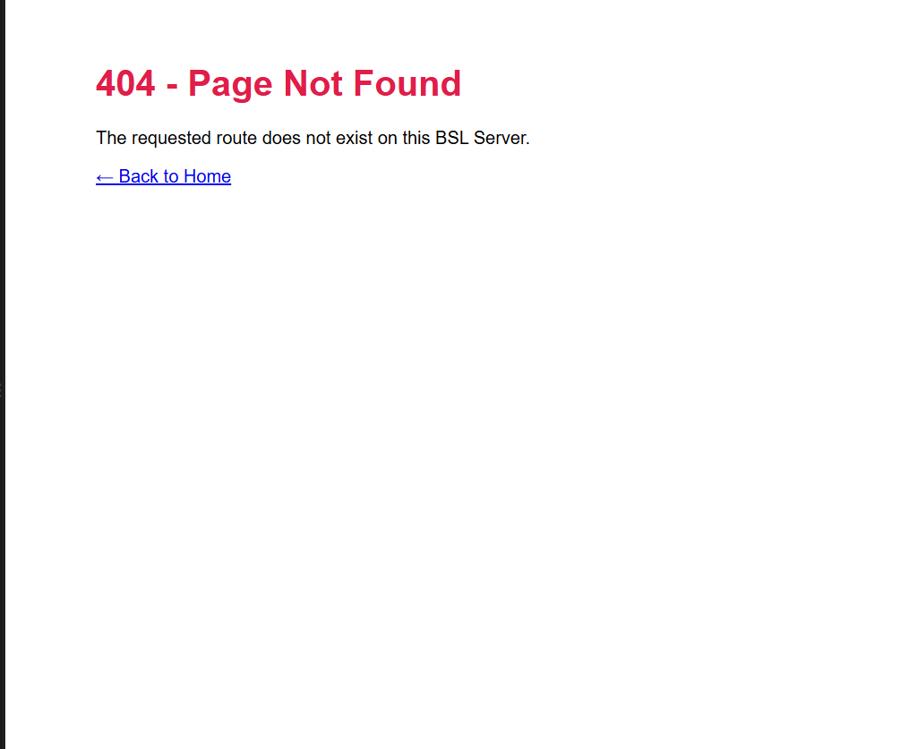
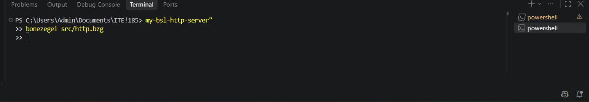

# my-bsl-http-server

A low-level HTTP/1.1 web server built **from scratch** in the [Bonezegei Scripting Language (BSL)](https://bonezegei.com/tutorials/bsl/whatisbsl) using the BSL Socket Library.

> **ITE 185 — Lab 1: Building an HTTP Server using Socket**

---

## Table of Contents

- [Project Description](#project-description)
- [Features](#features)
- [Project Structure](#project-structure)
- [Installation & Setup Guide](#installation--setup-guide)
- [Running the Server](#running-the-server)
- [Usage Instructions](#usage-instructions)
- [How It Works](#how-it-works)
- [Screenshots](#screenshots)
- [Troubleshooting](#troubleshooting)
- [License](#license)

---

## Project Description

This project implements a working web server without using any web framework, HTTP library, or
pre-built router. Everything is handled at the raw TCP socket level.

The server opens a TCP socket, binds it to **port 8080**, listens for incoming connections, and for
each client that connects it:

1. Reads the raw HTTP request bytes off the socket.
2. Inspects the request line to determine which path was requested.
3. Builds the appropriate HTTP status line, headers, and HTML body by hand.
4. Writes the raw response back to the socket and closes the connection.

The purpose of the activity is to understand what actually happens underneath frameworks like
Express, Flask, or Apache — how an HTTP response is nothing more than a formatted string sent over
a TCP connection.

---

## Features

- Pure socket implementation — no web framework, no HTTP helper library
- HTTP/1.1 compliant responses with proper status line and headers
- Correct `Content-Type`, `Content-Length`, and `Connection` headers
- Custom route handling for `/` and `/about`
- Custom **404 Not Found** page for every unmapped route
- Request logging to the terminal for every incoming connection
- Manual garbage collection per request to keep memory usage flat

---

## Project Structure

```
my-bsl-http-server/
├── .gitattributes          # Forces GitHub to syntax-highlight .bzg as JavaScript
├── LICENSE                 # MIT License
├── README.md               # This file
├── src/
│   └── http.bzg            # The HTTP server source code
└── documentation/
    ├── home.png            # Screenshot of the / route
    ├── about.png           # Screenshot of the /about route
    ├── 404.png             # Screenshot of an unmapped route
    └── terminal.png        # Screenshot of the terminal running the server
```

---

## Installation & Setup Guide

### Step 1 — Install the VS Code Extension

1. Open **Visual Studio Code**.
2. Go to the **Extensions** tab (`Ctrl+Shift+X` on Windows/Linux, `Cmd+Shift+X` on macOS).
3. Search for **"Bonezegei"**.
4. Install the **Bonezegei Scripting Language Formatter** extension.

This gives you syntax highlighting, formatting, and a **Run Script** button for `.bzg` files.

### Step 2 — Install the BSL Interpreter

The extension is only an editor plugin — the interpreter is a separate install.

**Windows**

1. Open the **Microsoft Store** from the Start Menu.
2. Search for **"Bonezegei Scripting Language"**.
3. Click **Get / Install** and wait for it to finish.

   Or install directly from [this Microsoft Store link](https://apps.microsoft.com/store/detail/XP9LZSQ13RSLNN).

**Linux (x86)**

```bash
wget https://github.com/bonezegei/Bonezegei_Scripting_Language/raw/refs/heads/main/Release/Latest/Bonezegei-x86.deb
sudo apt install ./Bonezegei-x86.deb
```

**macOS / Android**

These platforms are not supported natively. Use **GitHub Codespaces** and follow the Linux
installation steps above.

### Step 3 — Verify the Installation

Open a **new** terminal (so it picks up the updated `PATH`) and run:

```bash
bonezegei --version
```

You should see the interpreter version printed. You can also test inline scripting:

```bash
bonezegei -inline "print(\"Hello World\");"
```

### Step 4 — Install the BSL Socket Library

The socket library is installed with the `bzg` package manager, which ships alongside the
interpreter. **Run this from the root of the repository** — `include("lib/socket.bzg")` resolves
relative to your current working directory, so the `lib/` folder must sit next to `src/`:

```bash
cd my-bsl-http-server
bzg install socket
```

This creates a local `lib/` folder containing `socket.bzg` and `socket/socket.dll`. It is a
dependency rather than source code, so it is listed in `.gitignore` and is not committed — anyone
cloning this repository simply runs the command above.

To see all available packages:

```bash
bzg -list
```

### Step 5 — Clone This Repository

```bash
git clone https://github.com/ken-dot4/my-bsl-http-server.git
cd my-bsl-http-server
```

---

## Running the Server

From the root of the repository, run:

```bash
bonezegei src/http.bzg
```

Alternatively, open `src/http.bzg` in VS Code and click **Run Script**.

You should see:

```
Socket Ready
Server running on http://localhost:8080/
Press Ctrl+C to stop the server.
```

The server runs in an infinite loop. Press **Ctrl+C** in the terminal to stop it.

---

## Usage Instructions

With the server running, open a browser and visit any of the following:

| URL | Route | Expected Response |
| --- | --- | --- |
| <http://localhost:8080/> | `/` | `200 OK` — welcome / landing page |
| <http://localhost:8080/about> | `/about` | `200 OK` — project and developer details |
| <http://localhost:8080/anything> | unmapped | `404 Not Found` — custom error page |
| <http://localhost:8080/home> | unmapped | `404 Not Found` — custom error page |
| <http://localhost:8080/user> | unmapped | `404 Not Found` — custom error page |

You can also test from the terminal with `curl` to see the raw HTTP response including headers:

```bash
curl -i http://localhost:8080/
curl -i http://localhost:8080/about
curl -i http://localhost:8080/anything
```

Every request is logged in the server terminal, so you can watch the raw request arrive as you
browse.

---

## How It Works

The server follows the classic BSD socket server lifecycle:

| Step | Function | Purpose |
| --- | --- | --- |
| 1 | `socket_init()` | Initializes the socket subsystem |
| 2 | `socket_create()` | Creates the server socket descriptor |
| 3 | `socket_bind(server, 0, 8080)` | Binds the socket to port 8080 on all interfaces |
| 4 | `socket_listen(server, 5)` | Starts listening with a backlog of 5 pending connections |
| 5 | `socket_accept(server)` | Blocks until a client connects, returns a client socket |
| 6 | `socket_read(client, 1024)` | Reads up to 1024 bytes of the raw HTTP request |
| 7 | `socket_write(client, ...)` | Writes the raw HTTP response back to the client |
| 8 | `socket_close(client)` | Closes the client connection |

### Routing

Every HTTP request begins with a request line in the form:

```
GET /about?id=1 HTTP/1.1
^   ^           ^
|   |           `-- protocol version
|   `-- the path we want
`-- HTTP method
```

The `requestPath()` helper walks that line with `substr()` to slice out the middle field, then
strips any query string and trailing slash. Routing is then a plain comparison on the extracted
path:

```javascript
var path = requestPath(data);

if (path == "/") {
    // home page
} else if (path == "/about") {
    // about page
} else {
    // 404 fallback
}
```

> **Note on the interpreter:** BSL v1.3.1 does not implement `.indexOf()` as a string method —
> calling it raises `Attempt to call method on non-object type`. The path is therefore parsed
> character by character with `substr()`, which is supported. Matching on the exact path is also
> more correct than substring matching: a route like `/aboutus` correctly returns 404 instead of
> being mistaken for `/about`.

### Response Format

An HTTP response is just a string. For example, the 404 response is built as:

```
HTTP/1.1 404 Not Found\r\n
Content-Type: text/html\r\n
Content-Length: <length of body>\r\n
Connection: close\r\n
\r\n
<html body>
```

The blank line (`\r\n\r\n`) is what separates the headers from the body — get that wrong and the
browser will hang waiting for more headers.

---

## Screenshots

### Home Page — `/`



### About Page — `/about`



### 404 Not Found — unmapped route



### Server Running in the Terminal



---

## Troubleshooting

| Problem | Cause / Fix |
| --- | --- |
| `bonezegei: command not found` | The interpreter is not installed, or your terminal was open before installing. Close and reopen the terminal. |
| `bzg: command not found` | Same as above — `bzg` ships with the interpreter, not with the VS Code extension. |
| `Socket Bind Failed.` | Port 8080 is already in use. Close whatever is using it, or change the port in `src/http.bzg`. |
| Cannot find `lib/socket.bzg` | The socket library is missing from your working directory. Run `bzg install socket` from the repository root, then run the server from that same folder. |
| Browser hangs and never loads | The header/body separator is malformed. Ensure the header block ends with `\r\n\r\n`. |
| Page shows raw HTML as text | The `Content-Type: text/html` header is missing or misspelled. |
| `Attempt to call method on non-object type` | You are using a string method such as `.indexOf()`, which BSL v1.3.1 does not support. Use `substr()` instead. |

---

## License

This project is licensed under the **MIT License** — see the [LICENSE](LICENSE) file for details.

---

## Author

**Ken Madrinan**
ITE 185 — Lab 1: Building an HTTP Server using Socket
